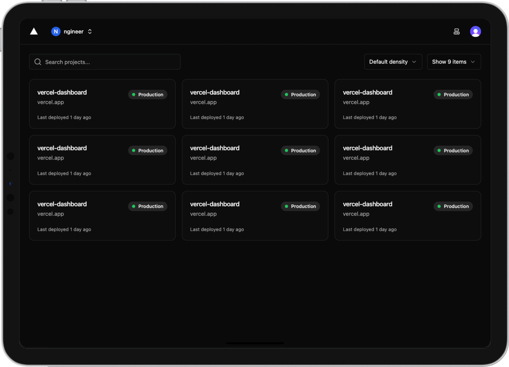

<p align="center">
  
</p>

<h1 align="center">Vercel Dashboard</h1>

<p align="center">Custom Vercel dashboard with better accessibility and UX.</p>

<p align="center">
  
</p>

## Features

- List of all your Vercel projects
- See real-time deployment statuses of your projects
- Supports multiple Vercel accounts
- Authentication with Clerk

## Stack

- Next.js `15.1.x`
- Tailwind CSS `3.x`
- shadcn/ui
- tRPC `11.x`
- Clerk

## Requirements

- Node.js `20.x`

## Getting started

1. Install Node.js dependencies:

```sh
pnpm install
```

2. If you're using [Dotenv](https://www.dotenv.org), see [here](#dotenv); otherwise continue.

3. Create a new file called `.env.local` and paste the following:

```sh
CLERK_SECRET_KEY=sk_test_xxx
NEXT_PUBLIC_CLERK_PUBLISHABLE_KEY=pk_test_xxx
NEXT_PUBLIC_CLERK_SIGN_IN_URL=/sign-in
NEXT_PUBLIC_CLERK_SIGN_UP_URL=/sign-up
```

> [!IMPORTANT]
> Replace the values according to your environment.
> Create a Clerk account if you don't have one already.

### Dotenv

1. Create a file `.env.me` and paste this:
    
```sh
DOTENV_ME="me_xxx"
```
    
2. Run in your terminal:
    
```sh
npx dotenv-vault pull development
```
    
3. This will pull the `.env` file and add it to your local directory.

## Development

**Start the local development server**

```sh
pnpm dev
```

Open [http://localhost:3000](http://localhost:3000) in your browser.

## License

[MIT License](LICENSE)
